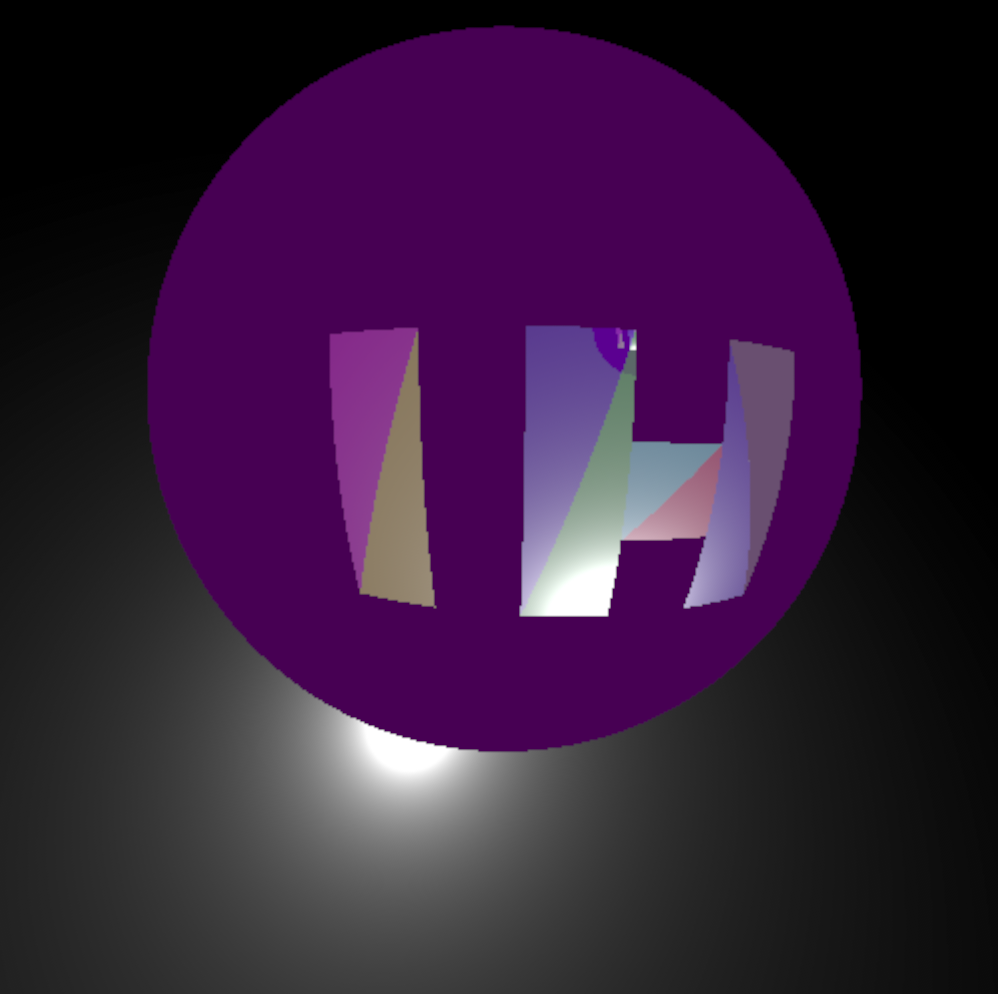
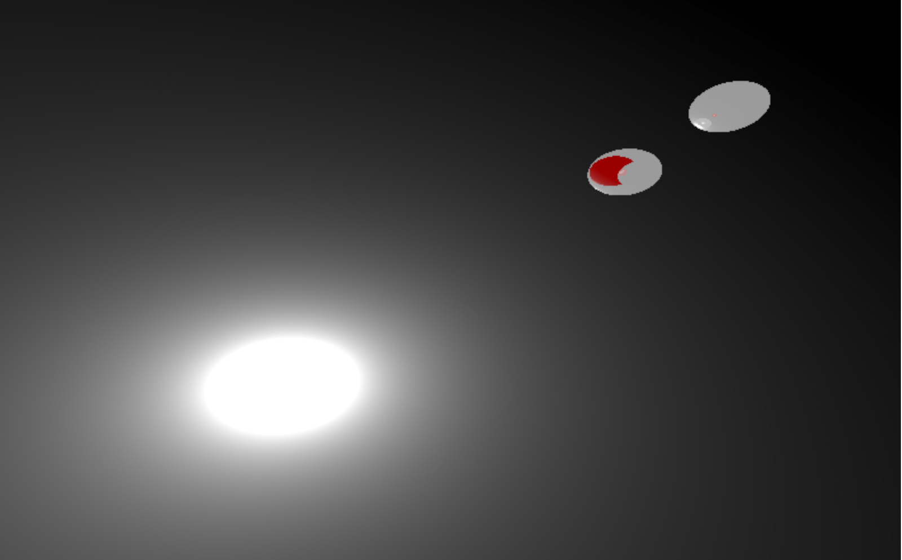

i have made a little renderer
i still want to add different kinds of reflections
this is cpu based for shits and giggles (sorry if you are a prospective employer, i won't do it again)
the only dependancies are something to show the rendering (egui) and something to represent and do vector maths (nalgebra)

## todo
make the reflections behave normally

## current as of 5/5/25
i can render planes, spheres, triangles and lights
these can be read in from a csv file, i'm thinking about adding support for stls
the reflections are just done on the normal of the surface, rather than a proper $\theta_{incident}$ = $\theta_{outgoing}$ nice looking reflection

this is currently what it looks like when you spawn in, the scene file for this is given in many_tris.csv

and this is what the reflection of the scene looks like in a sphere

## old

this is the old capabilities, there is a light, some coloured objects, and specular reflection. still got loads more to work on (see the red sphere oops)
